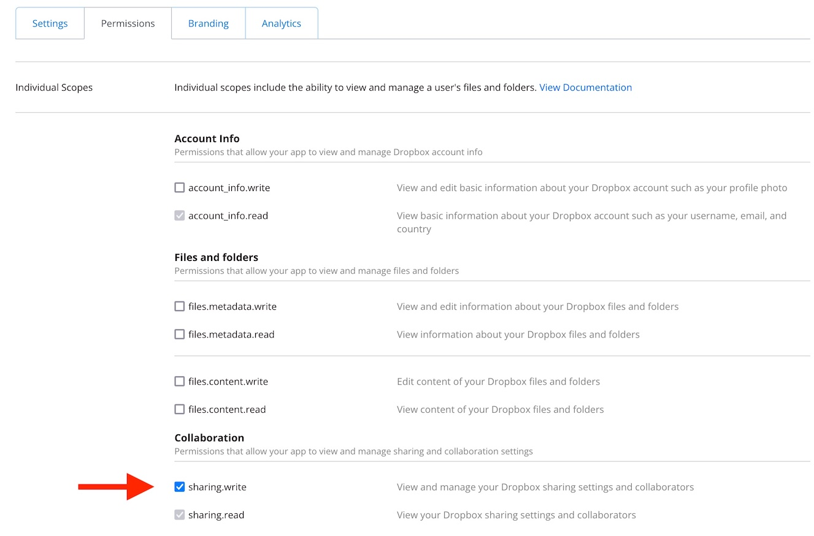
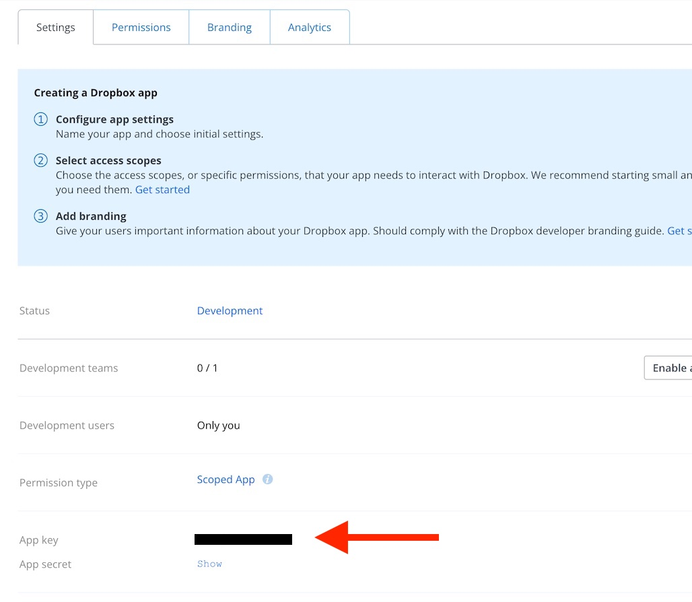
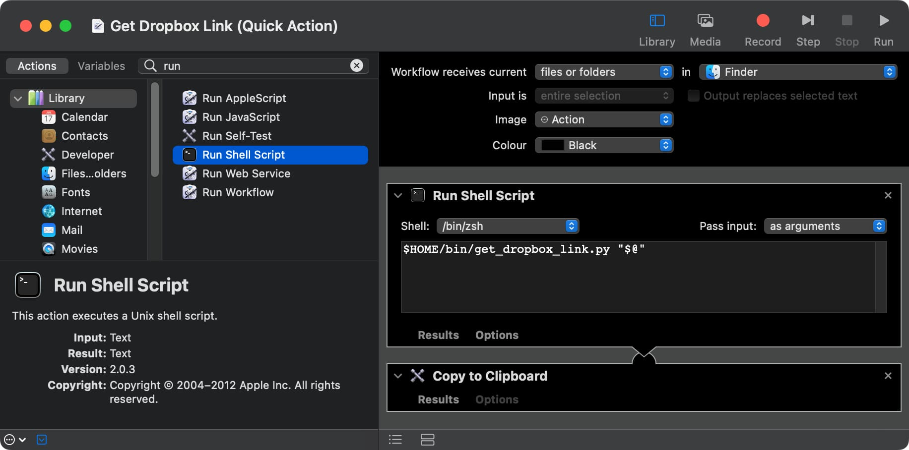
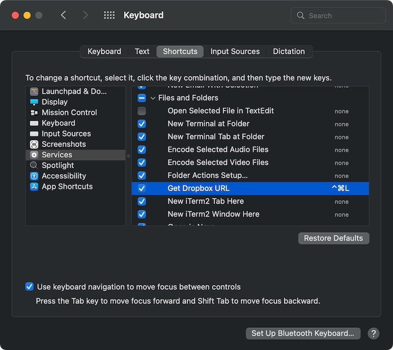

# Get Dropbox Link
Dropbox should provide a keyboard command to quickly get a link in Finder for a file in the Dropbox folder. Sadly, despite years of requests, this still isn't possible.

So I wrote this script to do that. Read more about it on the [Dropbox Forum](https://www.dropboxforum.com/t5/View-download-and-export/Key-Command-Shortcut-to-quot-Copy-Dropbox-Link-quot-from-Mac/td-p/168482/highlight/false).

## Instructions

### Script setup
1. Download the script and place it somewhere in your `PATH`, for example `$HOME/bin`.

2. Install the dropbox Python SDK and pin urllib3 to an earlier version. (The second command may not be necessary in your case, see issue [#6](https://github.com/nk9/get_dropbox_link/issues/6).)

    ```
    /usr/bin/python3 -m pip install dropbox
    /usr/bin/python3 -m pip install urllib3==1.26.6
    ```

3. [Create a Dropbox app](https://blogs.dropbox.com/developers/2014/05/generate-an-access-token-for-your-own-account) on the [Dropbox App Console](https://www.dropbox.com/developers/apps).
4. Give the app an access type of Full Access.
5. Create it.
6. Change the Permissions settings to have a scope of `sharing.write`.



7. Reload the page. (This is in case you've already created an access token. Once you change the permissions, you need to generate a new token!)
8. Copy the App Key:



9. Use this to update the `APP_KEY` variable on line 39 in the script file.
10. If you use a Dropbox Business account, change the `ACCOUNT_TYPE` variable on line 54.
11. Set permissions so you can run the script:

    ```
    chmod +x ~/bin/get_dropbox_link.py
    ```

12. Call the script once and follow the instructions to get a refresh token the first time:

    ```
    $ get_dropbox_link.py ~/Dropbox/Public/cat.jpg
    Refresh token not found. Let's generate a new one.
    1. Go to: https://www.dropbox.com/oauth2/authorize?xxxx
    2. Click "Allow", etc. (You may need to log in first.)
    3. Copy the Access Code.
    Enter the Access Code here: xxxx
    https://www.dropbox.com/s/xxxx/cat.jpg?dl=0
    ```
    Now you can continue calling it to generate links.

    ```
    $ get_dropbox_link.py ~/Dropbox/file.txt
    https://www.dropbox.com/s/xxxx/file.txt?dl=0
    $
    ```

### Automator setup
My goal was to have a keyboard shortcut in Finder that would copy a Dropbox link to the clipboard. If you want to do that too, you'll need to add an [Automator](https://support.apple.com/en-gb/guide/automator/welcome/mac) Quick Action. Choose one of these options:

#### Easy way
1. Clone or [download](https://github.com/nk9/get_dropbox_link/archive/refs/heads/main.tar.gz) this git repository.
2. Unzip it and then double-click the "Get Dropbox Link" workflow.
3. Press Install.

    > **Warning**
    >
    > If you have installed the script somewhere other than `~/bin/get_dropbox_link.py`, you will need to edit the workflow to point at your custom location. You can find it in ~/Library/Services.

#### Manual way
1. Open Automator and create a new Quick Action.
2. Find and drag over two actions: Run Shell Script, and Copy to Clipboard.
3. In the Run Shell Script action, give it the content of:
    ```
    $HOME/bin/get_dropbox_link.py "$@"
    ```
    > **Warning**
    >
    > Make sure you set the workflow to receive the current files or folders from Finder. Also, change the popup button to _Pass input as arguments_.

    > **Warning**
    >
    > Make sure the path here is the same as the path that you saved the script to earlier!

4. Save the Quick Action to the default location (~/Library/Services). Give it the name you want it to have in the menu, like "Get Dropbox Link".

5. Once you're done, the action should look like this:

    

> **Info**
>
> Please note that pressing "Run" within Automator will complain about missing the `paths` argument. This is correct, and happens because Automator doesn't have any selected Finder items to pass into the workflow. Instead, you need to hook up the shortcut below and use the workflow as a Quick Action from Finder via the Services menu.


### Finder shortcut
Now that you have the script and workflow installed, the last piece is the Finder shortcut.

1. Open System Preferences > Keyboard > Shortcuts and navigate to Services. It will probably appear under "Files and Folders", but may also be under "General".
2. Make sure the checkbox to the left is checked, and give it a shortcut. Here, I've  chosen <kbd>Cmd</kbd>+<kbd>Ctrl</kbd>+<kbd>L</kbd>.



3. Now, you can test it! Go to your Dropbox folder in Finder. Select at least one file and press <kbd>Cmd</kbd>+<kbd>Ctrl</kbd>+<kbd>L</kbd>. Your clipboard should now contain the links to the files. Note that when creating multiple links, each link has to be requested individually, so there may be a delay before the links appear on your clipboard. Watch for the spinning Automator gear in your menu bar.
