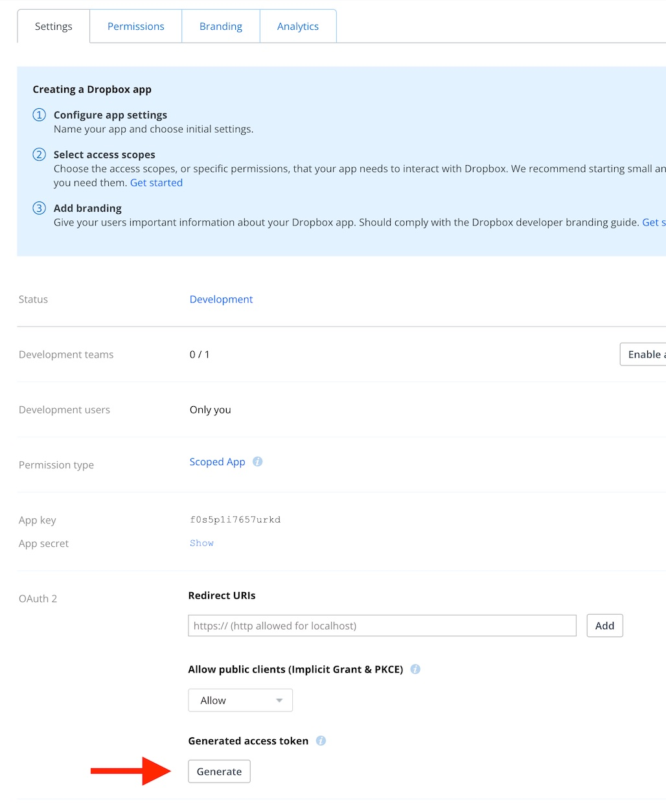

# Get Dropbox Link
Dropbox should provide a keyboard command to quickly get a link in Finder for a file in the Dropbox folder. Sadly, despite years of requests, this still isn't possible.

So I wrote this script to do that. Read more about it on the [Dropbox Forum](https://www.dropboxforum.com/t5/View-download-and-export/Key-Command-Shortcut-to-quot-Copy-Dropbox-Link-quot-from-Mac/td-p/168482/highlight/false).

## Instructions

### Script setup
1. Download the script and place it somewhere in your `PATH`, for example `$HOME/bin`.

2. Install the dropbox Python SDK:

    ```
    pip3 install dropbox
    ```

3. [Create a Dropbox app](https://blogs.dropbox.com/developers/2014/05/generate-an-access-token-for-your-own-account) on the [Dropbox App Console](https://www.dropbox.com/developers/apps).
4. Give the app an access type of Full Access.
5. Create it.
6. Change the Permissions settings to have a scope of `sharing.write`.


7. Reload the page. (This is in case you've already created an access token. Once you change the permissions, you need to generate a new token!)
8. Generate a new access token.



9. Use this to update the `TOKEN` variable on line 37 in the script file.
10. If you use a Dropbox Business account, change the `ACCOUNT_TYPE` variable on line 42.
11. Set permissions so you can run the script:

```
chmod +x ~/bin/get_dropbox_url.py
```

Now you can call it to generate links.

```
$ get_dropbox_url.py ~/Dropbox/file.txt
https://www.dropbox.com/s/wlz10rosbw29r1t/file.txt?dl=0
$
```

### Automator setup
My goal was to have a keyboard shortcut in Finder that would copy a Dropbox URL to the clipboard. If you want to do that too, you'll need to add an [Automator](https://support.apple.com/en-gb/guide/automator/welcome/mac) Quick Action. Here's how you do that.

1. Open Automator and create a new Quick Action.
2. Find and drag over three actions: Get Selected Finder Items, Run Shell Script, and Copy to Clipboard.
3. In the Run Shell Script action, give it the content of:
    ```
    for f in "$@"
    do
        $HOME/bin/get_dropbox_url.py "$f"
    done
    ```
    Make sure you change the popup button to _Pass input as arguments_.

    > **Warning**
    >
    > Make sure the path here is the same as the path that you saved the script to earlier!

4. Save the Quick Action to the default location. Give it the name you want it to have in the menu, like "Get Dropbox URL".

5. Once you're done, the action should look like this:


6. Now, you need to assign a keyboard command to this action. Open System Preferences > Keyboard > Shortcuts and navigate to Services. It will probably appear under "Files and Folders", but may also be under "General".
7. Make sure the checkbox to the left is checked, and give it a shortcut. Here, I've  chosen <kbd>Cmd</kbd>+<kbd>Ctrl</kbd>+<kbd>L</kbd>.


8. Now, you can test it! Go your Dropbox folder in Finder. Select at least one file and press <kbd>Cmd</kbd>+<kbd>Ctrl</kbd>+<kbd>L</kbd>. Your clipboard should now contain the links to the files.
